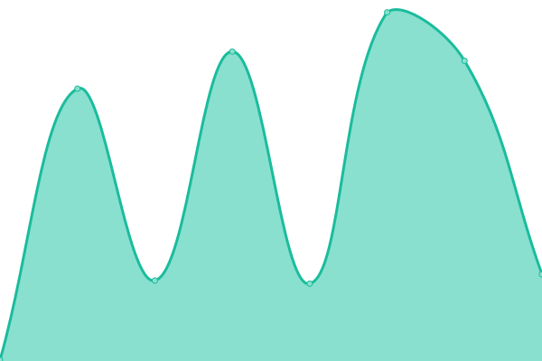
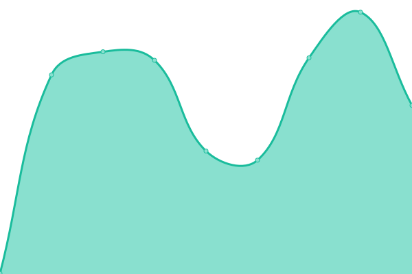
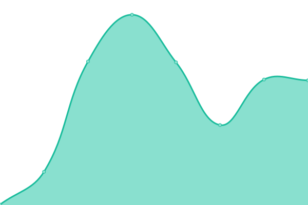
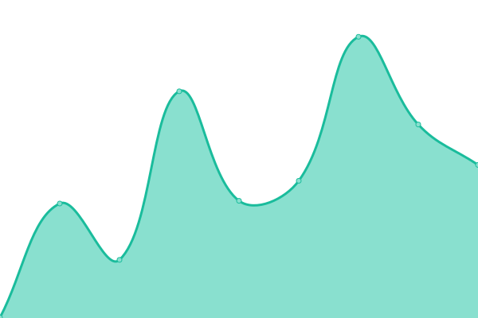

# [📈 Live Status](https://acm-uic.github.io/upptime): <!--live status--> **🟧 Partial outage**

This repository contains the open-source uptime monitor and status page for [ACM@UIC](acm.cs.uic.edu), powered by [Upptime](https://github.com/upptime/upptime).

With [Upptime](https://upptime.js.org), you can get your own unlimited and free uptime monitor and status page, powered entirely by a GitHub repository. We use [Issues](https://github.com/acm-uic/upptime/issues) as incident reports, [Actions](https://github.com/acm-uic/upptime/actions) as uptime monitors, and [Pages](https://acm-uic.github.io/upptime) for the status page.

<!--start: status pages-->
<!-- This summary is generated by Upptime (https://github.com/upptime/upptime) -->
<!-- Do not edit this manually, your changes will be overwritten -->
<!-- prettier-ignore -->
| URL | Status | History | Response Time | Uptime |
| --- | ------ | ------- | ------------- | ------ |
|  [ACM@UIC Website acm-uic.github.io](https://acm-uic.github.io) | 🟩 Up | [acm-uic-website-acm-uic-github-io.yml](https://github.com/acm-uic/upptime/commits/HEAD/history/acm-uic-website-acm-uic-github-io.yml) | 

 90ms
     
 | 

<a href="https://acm-uic.github.io/upptime/history/acm-uic-website-acm-uic-github-io">100.00%</a>
    

|  [ACM@UIC Website acmuic.org](https://acmuic.org) | 🟥 Down | [acm-uic-website-acmuic-org.yml](https://github.com/acm-uic/upptime/commits/HEAD/history/acm-uic-website-acmuic-org.yml) | 

 275ms
     
 | 

<a href="https://acm-uic.github.io/upptime/history/acm-uic-website-acmuic-org">0.00%</a>
    

|  [ACM@UIC Website acm.cs.uic.edu](https://acm.cs.uic.edu) | 🟩 Up | [acm-uic-website-acm-cs-uic-edu.yml](https://github.com/acm-uic/upptime/commits/HEAD/history/acm-uic-website-acm-cs-uic-edu.yml) | 

 282ms
     
 | 

<a href="https://acm-uic.github.io/upptime/history/acm-uic-website-acm-cs-uic-edu">100.00%</a>
    

|  [Plausible Analytics](https://plausible.acmuic.org/api/health) | 🟥 Down | [plausible-analytics.yml](https://github.com/acm-uic/upptime/commits/HEAD/history/plausible-analytics.yml) | 

 449ms
     
 | 

<a href="https://acm-uic.github.io/upptime/history/plausible-analytics">100.00%</a>
    

|  [ACM@UIC Website Typesense](https://typesense.acmuic.org/health) | 🟥 Down | [acm-uic-website-typesense.yml](https://github.com/acm-uic/upptime/commits/HEAD/history/acm-uic-website-typesense.yml) | 

 470ms
     
 | 

<a href="https://acm-uic.github.io/upptime/history/acm-uic-website-typesense">0.00%</a>
    

|  [Pathfinder](https://umpf.acmuic.org) | 🟩 Up | [pathfinder.yml](https://github.com/acm-uic/upptime/commits/HEAD/history/pathfinder.yml) | 

 356ms
     
 | 

<a href="https://acm-uic.github.io/upptime/history/pathfinder">100.00%</a>
    

|  [Oven Temp](https://oventemp.acmuic.org/api/health) | 🟩 Up | [oven-temp.yml](https://github.com/acm-uic/upptime/commits/HEAD/history/oven-temp.yml) | 

 415ms
     
 | 

<a href="https://acm-uic.github.io/upptime/history/oven-temp">100.00%</a>
    

<!--end: status pages-->

[**Visit our status website →**](https://acm-uic.github.io/upptime)

## 📄 License

- Powered by: [Upptime](https://github.com/upptime/upptime)
- Code: [MIT](./LICENSE) © [Anand Chowdhary](https://anandchowdhary.com), supported by [Pabio](https://pabio.com)
- Data in the `./history` directory: [Open Database License](https://opendatacommons.org/licenses/odbl/1-0/)
